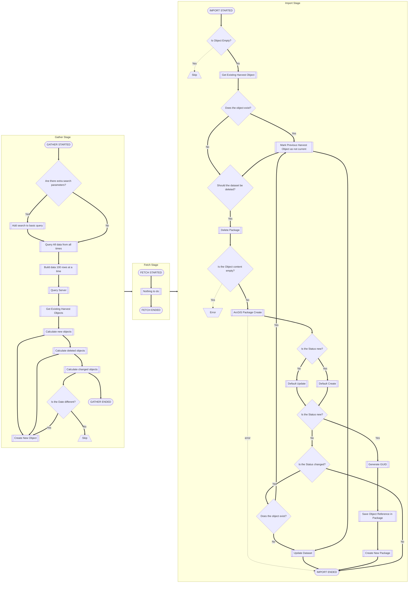

```mermaid
flowchart LR

  %% Algorithm
  gather_stage ==> fetch_stage
  fetch_stage ==> import_stage

  subgraph gather_stage [Gather Stage]
    direction TB
    gs([GATHER STARTED])
    ge([GATHER ENDED])
    gs ==> is_extra_search_criteria
    is_extra_search_criteria == Yes ==> add_to_query
    is_extra_search_criteria == No ==>basic_query
    add_to_query ==> basic_query
    basic_query ==> get_for_all_time
    get_for_all_time ==> query_arcgis
    query_arcgis ==> get_current_objects
    get_current_objects ==> compute_new
    compute_new ==> create_object
    compute_new ==> compute_deleted
    compute_deleted ==> create_object
    compute_deleted ==> compute_changed
    compute_changed ==> is_date_different
    is_date_different == Yes ==> create_object
    is_date_different == No ==> skip
    compute_changed ==> ge
  end
  subgraph fetch_stage [Fetch Stage]
    direction TB
    fs([FETCH STARTED])
    fe([FETCH ENDED])
    fs ==> do_nothing
    do_nothing ==> fe
  end
  subgraph import_stage [Import Stage]
    direction TB
    is([IMPORT STARTED])
    ie([IMPORT ENDED])
    is ==> is_object_empty
    is_object_empty-. Yes .-> skip_2
    is_object_empty == No ==> get_existing_object
    get_existing_object ==> is_existing_object
    is_existing_object == Yes ==> mark_not_current
    is_existing_object == No ==> is_delete
    mark_not_current ==> is_delete
    is_delete == Yes ==> delete
    delete ==> is_object_content_empty
    is_object_content_empty-. Yes .-> error
    is_object_content_empty == No ==> make_package_dict
    %% Code: https://github.com/GSA/ckanext-geodatagov/blob/984dc47087f981c15f7878bef5a96970adb78125/ckanext/geodatagov/harvesters/arcgis.py#L338-L431
    make_package_dict-. error .-> ie
    make_package_dict ==> is_status_new
    is_status_new == Yes ==> default_create_package_schema
    is_status_new == No ==> default_update_package_schema
    default_update_package_schema ==> is_status_new_2
    default_create_package_schema ==> is_status_new_2
    is_status_new_2 == Yes ==> generate_guid
    generate_guid ==> save_object_reference
    save_object_reference ==> create
    is_status_new_2 == No ==> is_status_changed
    is_status_changed == Yes ==> is_existing_object_2
    is_existing_object_2 == Yes ==> mark_not_current
    is_existing_object_2 == No ==> update
    mark_not_current ==> update
    update ==> ie
    create ==> ie
    is_status_changed == No ==> ie
  end

  %% Data
  error[\Error/]
  skip[/Skip\]
  skip_2[/Skip\]

  %% Functons
  %% Code: https://github.com/ckan/ckan/blob/master/ckan/logic/schema.py#L115-L194
  default_update_package_schema[[Default Update]]
  default_create_package_schema[[Default Create]]

  create_object[[Create New Object]]
  update[[Update Dataset]]
  do_nothing[[Nothing to do]]
  create[[Create New Package]]
  delete[[Delete Package]]
  save_object_reference[[Save Object Reference in Package]]
  generate_guid[[Generate GUID]]
  get_existing_object[[Get Existing Harvest Object]]
  mark_not_current[[Mark Previous Harvest Object as not current]]
  add_to_query[[Add search to basic query]]
  basic_query[[Query All data from all times]]
  get_for_all_time[[Build data 100 rows at a time]]
  query_arcgis[[Query Server]]
  get_current_objects[[Get Existing Harvest Objects]]
  compute_new[[Calculate new objects]]
  compute_deleted[[Calculate deleted objects]]
  compute_changed[[Calculate changed objects]]

  %% Code: https://github.com/GSA/ckanext-geodatagov/blob/984dc47087f981c15f7878bef5a96970adb78125/ckanext/geodatagov/harvesters/arcgis.py#L338-L431
  make_package_dict[[ArcGIS Package Create]]


  %% Conditional Checks
  is_extra_search_criteria{Are there extra search parameters?}
  is_existing_object{Does the object exist?}
  is_existing_object_2{Does the object exist?}
  is_object_empty{Is Object Empty?}
  is_object_content_empty{Is the Object content empty?}
  is_delete{Should the dataset be deleted?}
  is_status_new{Is the Status new?}
  is_status_new_2{Is the Status new?}
  is_status_changed{Is the Status changed?}
  is_date_different{Is the Date different?}

```
