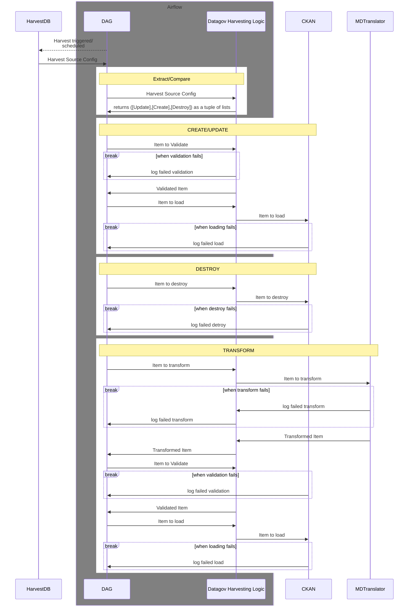

```mermaid
sequenceDiagram
    participant HDB as HarvestDB
    box gray Airflow
    participant DAG
    participant DHL as Datagov Harvesting Logic
    end
    participant CKAN
    participant MD as MDTranslator
    DAG-->>HDB: Harvest triggered/<br>scheduled
    HDB->>DAG: Harvest Source Config
    rect white
    Note over DAG,DHL: Extract/Compare
    DAG->>DHL: Harvest Source Config
    DHL->>DAG: returns ([Update],[Create],[Destroy]) as a tuple of lists
    end
    rect white
    Note over DAG,CKAN: CREATE/UPDATE
    DAG->>DHL: Item to Validate
    break when validation fails
        DHL->>DAG: log failed validation
    end
    DHL->>DAG: Validated Item
    DAG->>DHL: Item to load
    DHL->>CKAN: Item to load
    break when loading fails
        CKAN->>DAG: log failed load
    end
    end
    rect white
    Note over DAG,CKAN: DESTROY
    DAG->>DHL: Item to destroy
    DHL->>CKAN: Item to destroy
    break when destroy fails
        CKAN->>DAG: log failed detroy
    end
    end
    rect white
    Note over DAG,MD: TRANSFORM
    DAG->>DHL: Item to transform
    DHL->>MD: Item to transform
    break when transform fails
        MD->>DHL: log failed transform
        DHL->>DAG: log failed transform
    end    
    MD->>DHL: Transformed Item
    DHL->>DAG: Transformed Item
    DAG->>DHL: Item to Validate
    break when validation fails
        CKAN->>DAG: log failed validation
    end

    DHL->>DAG: Validated Item
    DAG->>DHL: Item to load
    DHL->>CKAN: Item to load
    break when loading fails
        CKAN->>DAG: log failed load
    end
    end
```
