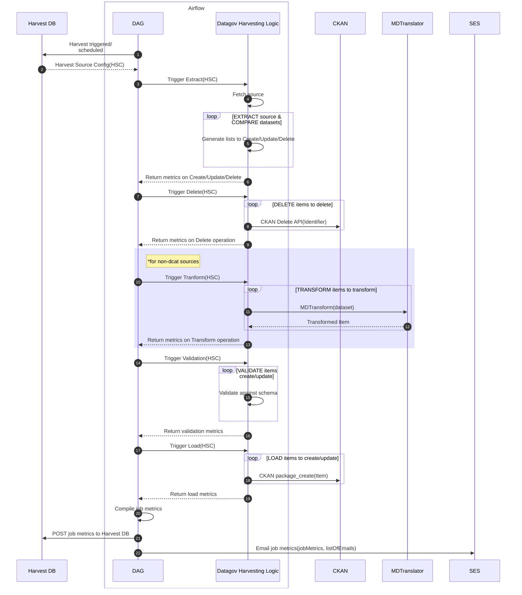

```mermaid
sequenceDiagram
    autonumber
    participant HDB as Harvest DB
    box transparent Airflow
    participant DAG
    participant DHL as Datagov Harvesting Logic
    end
    participant CKAN
    participant MD as MDTranslator
    participant SES
    DAG->>HDB: Harvest triggered/<br>scheduled
    HDB-->>DAG: Harvest Source Config(HSC)
    DAG->>DHL: Trigger Extract(HSC)
    DHL->>DHL: Fetch source
    loop EXTRACT source & COMPARE datasets
        DHL->>DHL: Generate lists to Create/Update/Delete
    end
    DHL-->>DAG: Return metrics on Create/Update/Delete
    DAG->>DHL: Trigger Delete(HSC)
    loop DELETE items to delete
        DHL->>CKAN: CKAN Delete API(Identifier)
    end
    DHL-->>DAG: Return metrics on Delete operation

    rect rgba(0, 0, 255, .1)
    note right of DAG: *for non-dcat sources
    DAG->>DHL: Trigger Tranform(HSC)
    loop TRANSFORM items to transform
        DHL->>MD: MDTransform(dataset)
        MD-->>DHL: Transformed Item
    end
    DHL-->>DAG: Return metrics on Transform operation
    end
    DAG->>DHL: Trigger Validation(HSC)
    loop VALIDATE items create/update
        DHL->>DHL: Validate against schema
    end
    DHL-->>DAG: Return validation metrics
    DAG->>DHL: Trigger Load(HSC)
    
    loop LOAD items to create/update
        DHL->>CKAN: CKAN package_create(Item)
    end
    DHL-->>DAG: Return load metrics
    DAG->>DAG: Compile job metrics
    DAG->>HDB: POST job metrics to Harvest DB
    DAG->>SES: Email job metrics(jobMetrics, listOfEmails)
    
```
