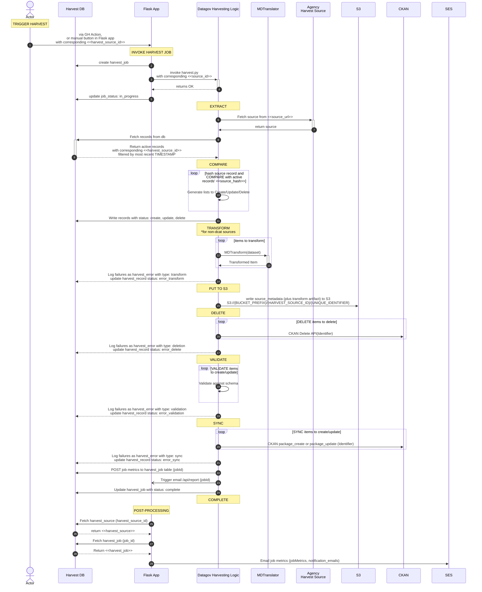

```mermaid
sequenceDiagram
    autonumber
    actor A as Actor
    participant HDB as Harvest DB
    participant FA as Flask App
    participant DHL as Datagov Harvesting Logic
    participant MD as MDTranslator
    participant HS as Agency<br>Harvest Source
    participant S3
    participant CKAN
    participant SES
    note over A: TRIGGER HARVEST
    A->>FA: via GH Action,<br>or manual button in Flask app<br>with corresponding <<harvest_source_id>>
    note over FA: INVOKE HARVEST JOB
    FA->>HDB: create harvest_job
    FA->>+DHL: invoke harvest.py<br> with corresponding <<source_id>>
    DHL-->>-FA: returns OK
    FA->>HDB: update job_status: in_progress
    note over DHL: EXTRACT
    DHL->>+HS: Fetch source from <<source_url>>
    HS->>-DHL: return source
    DHL->>+HDB: Fetch records from db
    HDB-->>-DHL: Return active records<br>with corresponding <<harvest_source_id>><br>filtered by most recent TIMESTAMP
    note over DHL: COMPARE
    loop hash source record and COMPARE with active records' <<source_hash>>
        DHL->>DHL: Generate lists to Create/Update/Delete
    end
    DHL->>HDB: Write records with status: create, update, delete
    note over DHL: TRANSFORM<br>*for non-dcat sources
    loop items to transform
        DHL->>+MD: MDTransform(dataset)
        MD-->>-DHL: Transformed Item
    end
    DHL-->>HDB: Log failures as harvest_error with type: transform<br>update harvest_record status: error_transform    
    note over DHL: PUT TO S3
    DHL->>S3: write source_metadata (plus transform artifact) to S3<br>S3://{BUCKET_PREFIX}/{HARVEST_SOURCE_ID}/{UNIQUE_IDENTIFIER}
    note over DHL: DELETE
    loop DELETE items to delete
        DHL->>CKAN: CKAN Delete API(Identifier)
    end
    DHL-->>HDB: Log failures as harvest_error with type: deletion<br>update harvest_record status: error_delete
    note over DHL: VALIDATE
    loop VALIDATE items to create/update
        DHL->>DHL: Validate against schema
    end
    DHL-->>HDB: Log failures as harvest_error with type: validation<br>update harvest_record status: error_validation
    note over DHL: SYNC
    loop SYNC items to create/update
        DHL->>CKAN: CKAN package_create or package_update (Identifier)
    end
    DHL-->>HDB: Log failures as harvest_error with type: sync<br>update harvest_record status: error_sync
    DHL->>HDB: POST job metrics to harvest_job table (jobId)
    DHL-)FA: Trigger email /api/report (jobId)
    DHL->>HDB: Update harvest_job with status: complete
    note over DHL: COMPLETE
    note over FA: POST-PROCESSING
    FA->>HDB: Fetch harvest_source (harvest_source_id)
    HDB-->>FA: return <<harvest_source>>
    FA->>HDB: Fetch harvest_job (job_id)
    HDB-->>FA: Return <<harvest_job>>
    FA->>SES: Email job metrics (jobMetrics, notification_emails)
```
