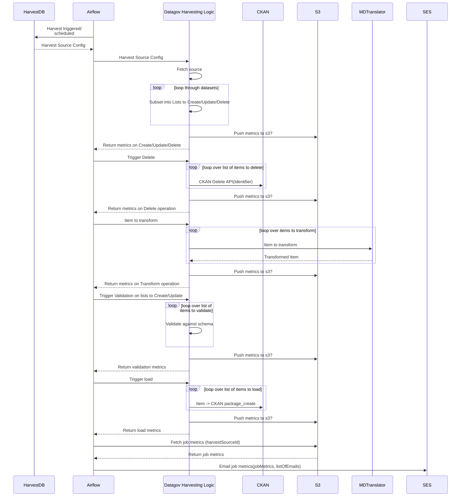

```mermaid
sequenceDiagram
    participant HDB as HarvestDB
    participant Airflow
    participant DHL as Datagov Harvesting Logic
    participant CKAN
    participant S3
    participant MD as MDTranslator
    participant SES
    Airflow->>HDB: Harvest triggered/<br>scheduled
    HDB-->>Airflow: Harvest Source Config
    Airflow->>DHL: Harvest Source Config
    DHL->>DHL: Fetch source
    loop loop through datasets
        DHL->>DHL: Subset into Lists to Create/Update/Delete
    end
    DHL->>S3: Push metrics to s3?
    DHL-->>Airflow: Return metrics on Create/Update/Delete
    Airflow->>DHL: Trigger Delete
    loop loop over list of items to delete
        DHL->>CKAN: CKAN Delete API(Identifier)
    end
    DHL->>S3: Push metrics to s3?
    DHL-->>Airflow: Return metrics on Delete operation

    Airflow->>DHL: Item to transform
    loop loop over items to transform
        DHL->>MD: Item to transform
        MD-->>DHL: Transformed Item
    end
    DHL->>S3: Push metrics to s3?    
    DHL-->>Airflow: Return metrics on Transform operation

    Airflow->>DHL: Trigger Validation on lists to Create/Update
    loop loop over list of items to validate
        DHL->>DHL: Validate against schema
    end
    DHL->>S3: Push metrics to s3?    
    DHL-->>Airflow: Return validation metrics
    Airflow->>DHL: Trigger load
    
    loop loop over list of items to load
        DHL->>CKAN: Item -> CKAN package_create
    end
    DHL->>S3: Push metrics to s3?    
    DHL-->>Airflow: Return load metrics
    Airflow->>S3: Fetch job metrics (harvestSourceId)
    S3-->>Airflow: Return job metrics
    Airflow->>SES: Email job metrics(jobMetrics, listOfEmails)
    
```
