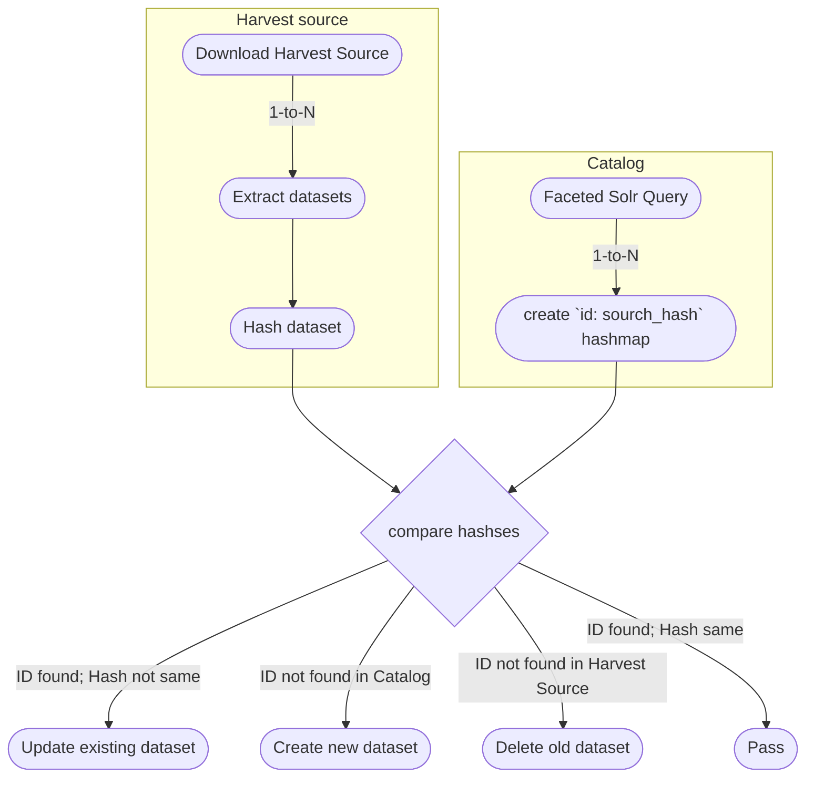

```mermaid
flowchart TD

subgraph Harvest source
  getHarvest([Download Harvest Source])
  extractHarvest([Extract datasets])
  hashDataset([Hash dataset])
end

subgraph Catalog
  queryCKAN([Faceted Solr Query])
  extractHash([create `id: sourch_hash` hashmap])
end

%% Operations
  compareHash{compare hashses}
  createDataset([Create new dataset])
  deleteDataset([Delete old dataset])
  updateDataset([Update existing dataset])


%% flow  
  getHarvest -- 1-to-N --> extractHarvest
  extractHarvest --> hashDataset
  hashDataset --> compareHash
  
  queryCKAN -- 1-to-N --> extractHash
  extractHash --> compareHash

  
  compareHash -- ID found; Hash not same --> updateDataset
  compareHash -- ID not found in Catalog --> createDataset
  compareHash -- ID not found in Harvest Source --> deleteDataset
  compareHash -- ID found; Hash same --> Pass([Pass])
```
