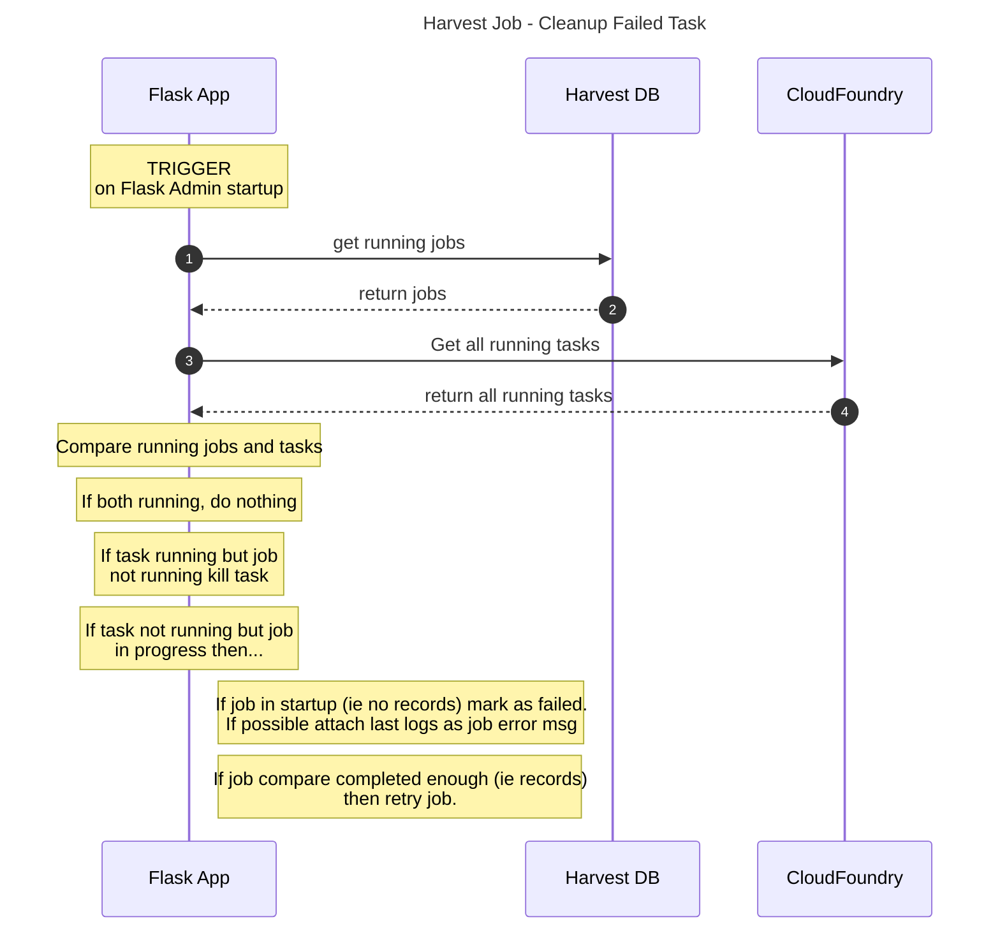

```mermaid
---
title: Harvest Job - Cleanup Failed Task
---
sequenceDiagram
    autonumber
    participant FA as Flask App
    participant HDB as Harvest DB
    participant CF as CloudFoundry
    note over FA: TRIGGER <br> on Flask Admin startup
    FA->>HDB: get running jobs
    HDB-->>FA: return jobs
    FA->>CF: Get all running tasks
    CF-->>FA: return all running tasks
    note over FA: Compare running jobs and tasks
    note over FA: If both running, do nothing
    note over FA: If task running but job<br>not running kill task
    note over FA: If task not running but job<br>in progress then...
    note right of FA: If job in startup (ie no records) mark as failed.<br> If possible attach last logs as job error msg
    note right of FA: If job compare completed enough (ie records)<br>then retry job.
```
