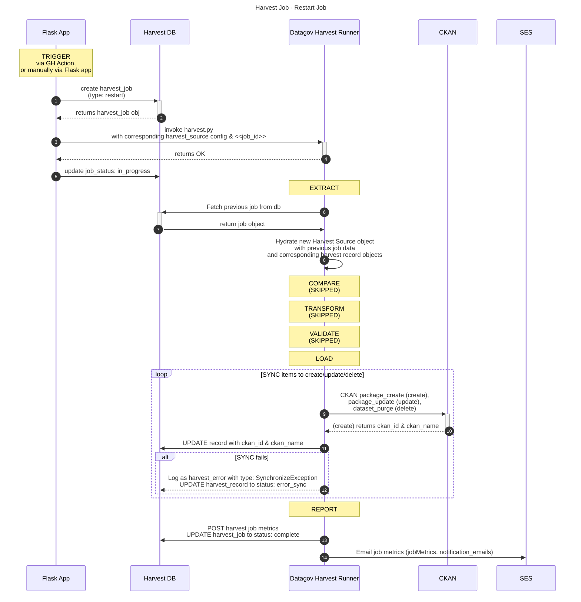

```mermaid
---
title: Harvest Job - Restart Job
---
sequenceDiagram
    autonumber
    participant FA as Flask App
    participant HDB as Harvest DB
    participant DHR as Datagov Harvest Runner
    participant CKAN
    participant SES
    note over FA: TRIGGER <br> via GH Action,<br>or manually via Flask app
    FA->>+HDB: create harvest_job<br>(type: restart)
    HDB-->>-FA: returns harvest_job obj
    FA->>+DHR: invoke harvest.py<br> with corresponding harvest_source config & <<job_id>>
    DHR-->>-FA: returns OK
    FA->>HDB: update job_status: in_progress
    note over DHR: EXTRACT
    DHR->>+HDB: Fetch previous job from db
    HDB->>-DHR: return job object
    DHR->>DHR: Hydrate new Harvest Source object<br>with previous job data<br>and corresponding harvest record objects
    note over DHR: COMPARE<br>(SKIPPED)
    note over DHR: TRANSFORM<br>(SKIPPED)
    note over DHR: VALIDATE<br>(SKIPPED)
    note over DHR: LOAD
    loop SYNC items to create/update/delete
        DHR->>+CKAN: CKAN package_create (create), <br>package_update (update), <br>dataset_purge (delete)
        CKAN-->>-DHR: (create) returns ckan_id & ckan_name
        DHR->>HDB: UPDATE record with ckan_id & ckan_name
        alt SYNC fails
            DHR-->>HDB: Log as harvest_error with type: SynchronizeException <br>UPDATE harvest_record to status: error_sync
        end
    end
    note over DHR: REPORT
    DHR->>HDB: POST harvest job metrics <br> UPDATE harvest_job to status: complete
    DHR->>SES: Email job metrics (jobMetrics, notification_emails)
```
