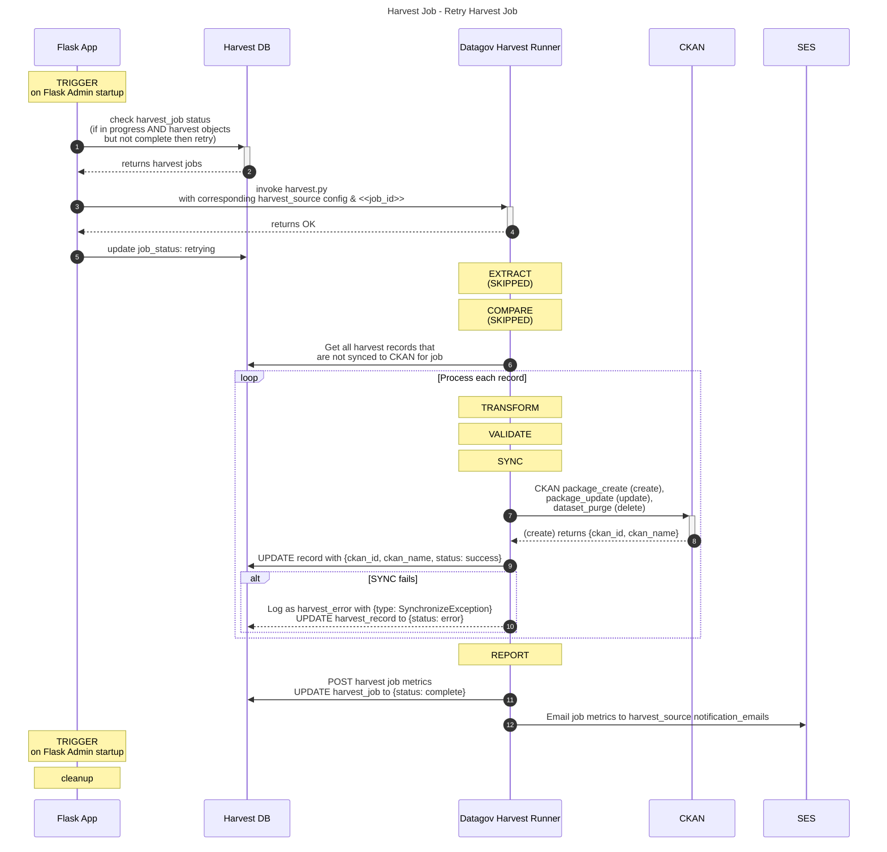

```mermaid
---
title: Harvest Job - Retry Harvest Job
---
sequenceDiagram
    autonumber
    participant FA as Flask App
    participant HDB as Harvest DB
    participant DHR as Datagov Harvest Runner
    participant CKAN
    participant SES
    note over FA: TRIGGER <br> on Flask Admin startup
    FA->>+HDB: check harvest_job status<br>(if in progress AND harvest objects<br>but not complete then retry)
    HDB-->>-FA: returns harvest jobs
    FA->>+DHR: invoke harvest.py<br> with corresponding harvest_source config & <<job_id>>
    DHR-->>-FA: returns OK
    FA->>HDB: update job_status: retrying
    note over DHR: EXTRACT<br>(SKIPPED)
    note over DHR: COMPARE<br>(SKIPPED)
    DHR->>HDB: Get all harvest records that<br> are not synced to CKAN for job
    loop Process each record
        note over DHR: TRANSFORM
        note over DHR: VALIDATE
        note over DHR: SYNC
        DHR->>+CKAN: CKAN package_create (create), <br>package_update (update), <br>dataset_purge (delete)
        CKAN-->>-DHR: (create) returns {ckan_id, ckan_name}
        DHR->>HDB: UPDATE record with {ckan_id, ckan_name, status: success}
        alt SYNC fails
            DHR-->>HDB: Log as harvest_error with {type: SynchronizeException}<br>UPDATE harvest_record to {status: error}
        end
    end
    
    note over DHR: REPORT
    DHR->>HDB: POST harvest job metrics <br> UPDATE harvest_job to {status: complete}
    DHR->>SES: Email job metrics to harvest_source notification_emails
    note over FA: TRIGGER <br> on Flask Admin startup
    note over FA: cleanup
```
