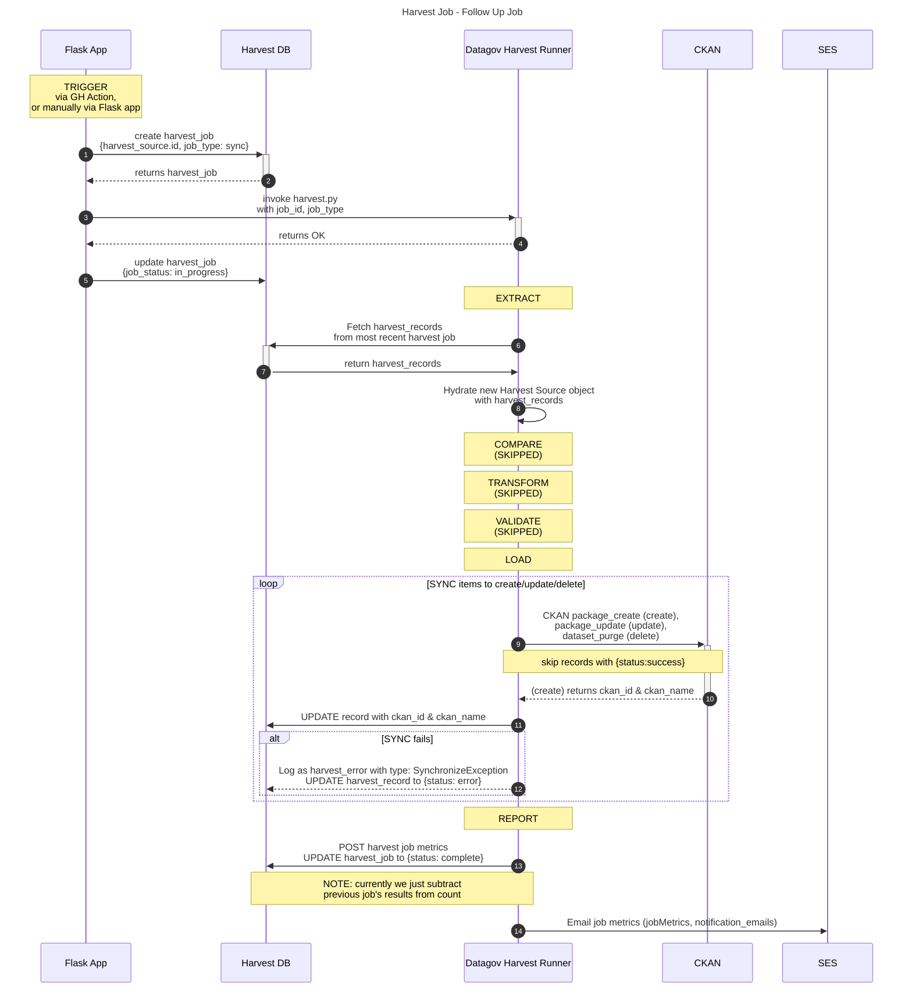

```mermaid
---
title: Harvest Job - Follow Up Job
---
sequenceDiagram
    autonumber
    participant FA as Flask App
    participant HDB as Harvest DB
    participant DHR as Datagov Harvest Runner
    participant CKAN
    participant SES
    note over FA: TRIGGER <br> via GH Action,<br>or manually via Flask app
    FA->>+HDB: create harvest_job<br>{harvest_source.id, job_type: sync}
    HDB-->>-FA: returns harvest_job
    FA->>+DHR: invoke harvest.py<br> with job_id, job_type
    DHR-->>-FA: returns OK
    FA->>HDB: update harvest_job<br>{job_status: in_progress}
    note over DHR: EXTRACT
    DHR->>+HDB: Fetch harvest_records<br>from most recent harvest job
    HDB->>-DHR: return harvest_records
    DHR->>DHR: Hydrate new Harvest Source object<br>with harvest_records
    note over DHR: COMPARE<br>(SKIPPED)
    note over DHR: TRANSFORM<br>(SKIPPED)
    note over DHR: VALIDATE<br>(SKIPPED)
    note over DHR: LOAD
    loop SYNC items to create/update/delete
        DHR->>+CKAN: CKAN package_create (create), <br>package_update (update), <br>dataset_purge (delete)
        note over DHR,CKAN: skip records with {status:success}
        CKAN-->>-DHR: (create) returns ckan_id & ckan_name
        DHR->>HDB: UPDATE record with ckan_id & ckan_name
        alt SYNC fails
            DHR-->>HDB: Log as harvest_error with type: SynchronizeException <br>UPDATE harvest_record to {status: error}
        end
    end
    note over DHR: REPORT
    DHR->>HDB: POST harvest job metrics <br> UPDATE harvest_job to {status: complete}
    note over DHR,HDB: NOTE: currently we just subtract<br>previous job's results from count
    DHR->>SES: Email job metrics (jobMetrics, notification_emails)
```
