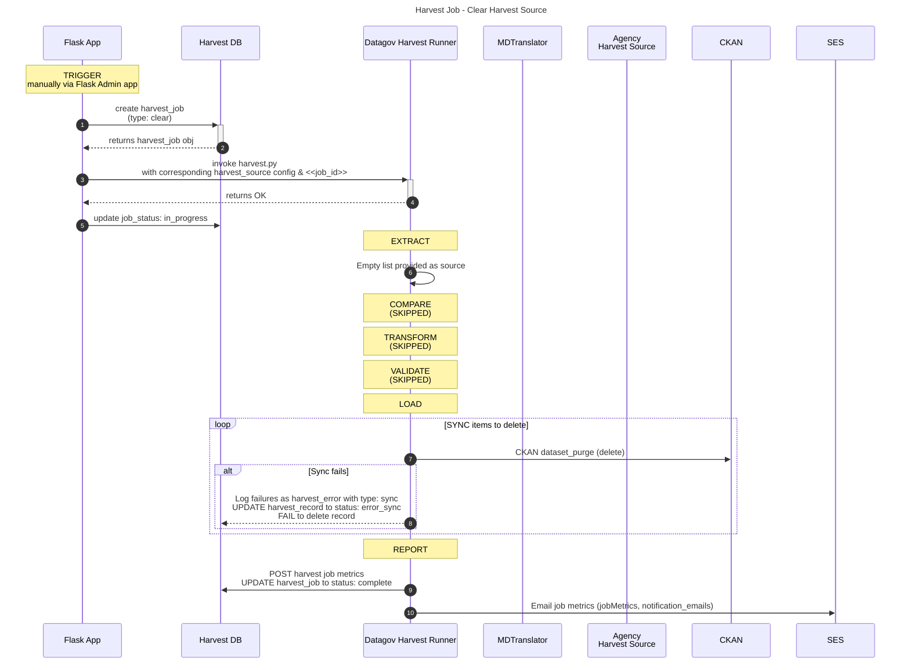

```mermaid
---
title: Harvest Job - Clear Harvest Source
---
sequenceDiagram
    autonumber
    participant FA as Flask App
    participant HDB as Harvest DB
    participant DHR as Datagov Harvest Runner
    participant MD as MDTranslator
    participant HS as Agency<br>Harvest Source
    participant CKAN
    participant SES
    note over FA: TRIGGER <br> manually via Flask Admin app
    FA->>+HDB: create harvest_job<br>(type: clear)
    HDB-->>-FA: returns harvest_job obj
    FA->>+DHR: invoke harvest.py<br> with corresponding harvest_source config & <<job_id>>
    DHR-->>-FA: returns OK
    FA->>HDB: update job_status: in_progress
    note over DHR: EXTRACT
    DHR->>DHR: Empty list provided as source
    note over DHR: COMPARE<br>(SKIPPED)
    note over DHR: TRANSFORM<br>(SKIPPED)
    note over DHR: VALIDATE<br>(SKIPPED)
    note over DHR: LOAD
    loop SYNC items to delete
        DHR->>CKAN: CKAN dataset_purge (delete)
        alt Sync fails
            DHR-->>HDB: Log failures as harvest_error with type: sync<br>UPDATE harvest_record to status: error_sync<br>FAIL to delete record
        end
    end
    note over DHR: REPORT
    DHR->>HDB: POST harvest job metrics <br> UPDATE harvest_job to status: complete
    DHR->>SES: Email job metrics (jobMetrics, notification_emails)
```
