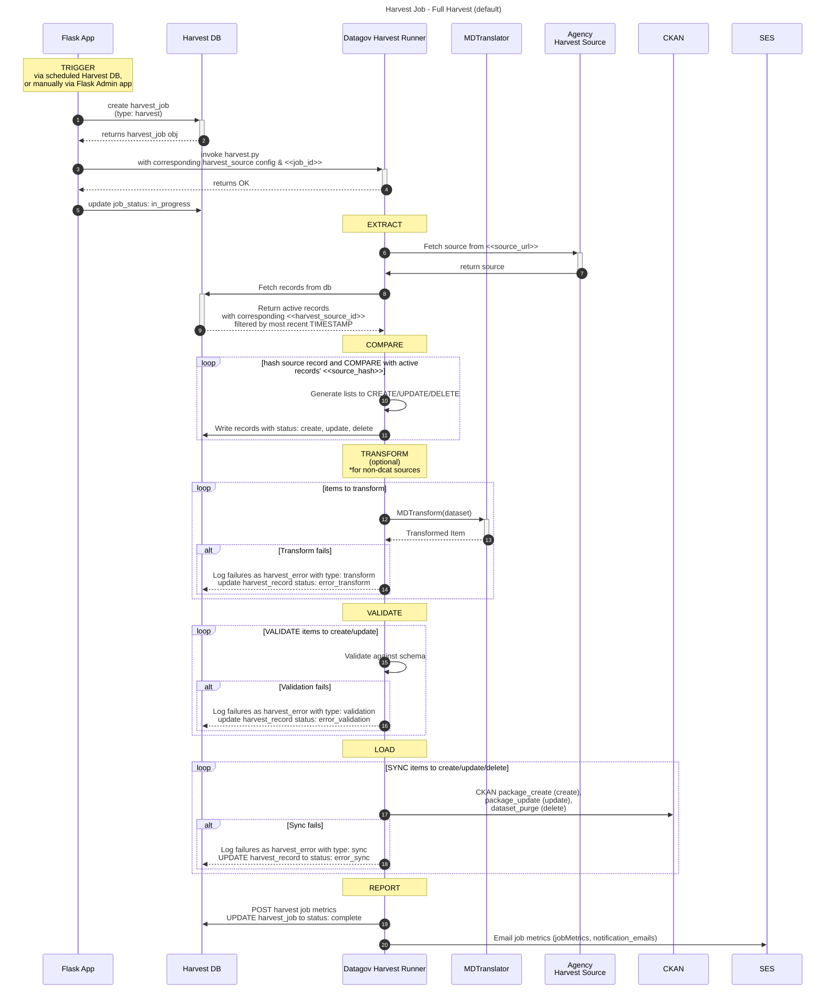

```mermaid
---
title: Harvest Job - Full Harvest (default)
---
sequenceDiagram
    autonumber
    participant FA as Flask App
    participant HDB as Harvest DB
    participant DHR as Datagov Harvest Runner
    participant MD as MDTranslator
    participant HS as Agency<br>Harvest Source
    participant CKAN
    participant SES
    note over FA: TRIGGER <br> via scheduled Harvest DB,<br>or manually via Flask Admin app
    FA->>+HDB: create harvest_job<br>(type: harvest)
    HDB-->>-FA: returns harvest_job obj
    FA->>+DHR: invoke harvest.py<br> with corresponding harvest_source config & <<job_id>>
    DHR-->>-FA: returns OK
    FA->>HDB: update job_status: in_progress
    note over DHR: EXTRACT
    DHR->>+HS: Fetch source from <<source_url>>
    HS->>-DHR: return source
    DHR->>+HDB: Fetch records from db
    HDB-->>-DHR: Return active records<br>with corresponding <<harvest_source_id>><br>filtered by most recent TIMESTAMP
    note over DHR: COMPARE
    loop hash source record and COMPARE with active records' <<source_hash>>
        DHR->>DHR: Generate lists to CREATE/UPDATE/DELETE
        DHR->>HDB: Write records with status: create, update, delete
    end
    note over DHR: TRANSFORM<br>(optional)<br>*for non-dcat sources
    loop items to transform
        DHR->>+MD: MDTransform(dataset)
        MD-->>-DHR: Transformed Item
        alt Transform fails
            DHR-->>HDB: Log failures as harvest_error with type: transform<br>update harvest_record status: error_transform
        end
    end
    note over DHR: VALIDATE
    loop VALIDATE items to create/update
        DHR->>DHR: Validate against schema
        alt Validation fails
            DHR-->>HDB: Log failures as harvest_error with type: validation<br>update harvest_record status: error_validation
        end
    end

    note over DHR: LOAD
    loop SYNC items to create/update/delete
        DHR->>CKAN: CKAN package_create (create), <br>package_update (update), <br>dataset_purge (delete)
        alt Sync fails
            DHR-->>HDB: Log failures as harvest_error with type: sync<br>UPDATE harvest_record to status: error_sync
        end
    end
    note over DHR: REPORT
    DHR->>HDB: POST harvest job metrics <br> UPDATE harvest_job to status: complete
    DHR->>SES: Email job metrics (jobMetrics, notification_emails)
```
