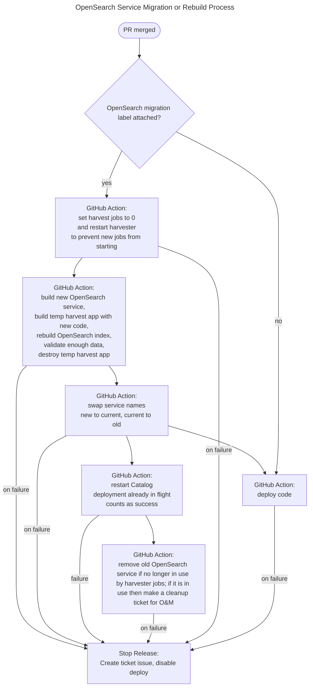

```mermaid
---
title: OpenSearch Service Migration or Rebuild Process
---
flowchart TD
	trigger([PR merged]) --> labelCheck{OpenSearch migration label attached?}

	scaleHarvest --> prepareOpenSearch[GitHub Action:<br/>build new OpenSearch service,<br/>build temp harvest app with new code,<br/>rebuild OpenSearch index,<br/>validate enough data,<br/>destroy temp harvest app]
	prepareOpenSearch -->|on failure| halt[Stop Release:<br/>Create ticket issue, disable deploy<br>]
	prepareOpenSearch --> swapServices[GitHub Action:<br/>swap service names<br/>new to current, current to old<br>]
	swapServices -->|on failure| halt

	swapServices --> deployCodeOnly[GitHub Action:<br/>deploy code]
	swapServices --> restartCatalogMigration[GitHub Action:<br/>restart Catalog<br/>deployment already in flight<br/>counts as success]
	restartCatalogMigration --> removeOld[GitHub Action:<br/>remove old OpenSearch service if no longer in use by harvester jobs; if it is in use then make a cleanup ticket for O&M]
	restartCatalogMigration -->|failure| halt
	removeOld -->|on failure| halt

    labelCheck -->|yes| scaleHarvest[GitHub Action:<br/>set harvest jobs to 0<br/>and restart harvester<br/>to prevent new jobs from starting]
	labelCheck -->|no| deployCodeOnly[GitHub Action:<br/>deploy code]
	scaleHarvest -->|on failure| halt
	deployCodeOnly -->|on failure| halt
```
