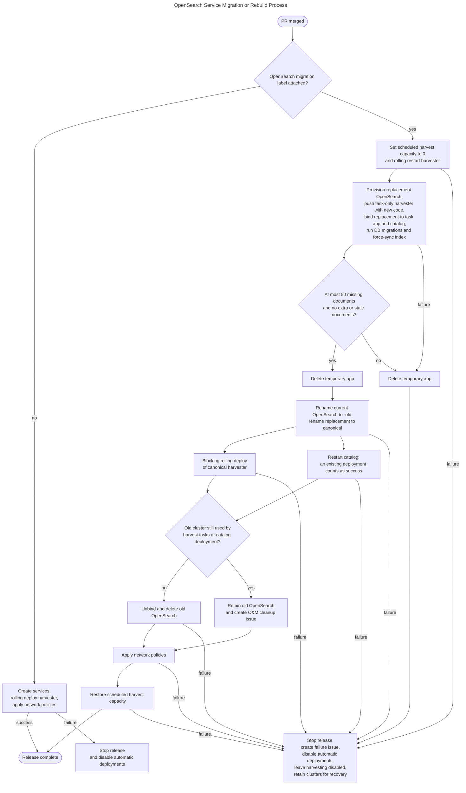

```mermaid
---
title: OpenSearch Service Migration or Rebuild Process
---
flowchart TD
	trigger([PR merged]) --> labelCheck{OpenSearch migration label attached?}

	labelCheck -->|no| deployCodeOnly[Create services,<br/>rolling deploy harvester,<br/>apply network policies]
	deployCodeOnly -->|success| complete([Release complete])
	deployCodeOnly -->|failure| normalFailure[Stop release<br/>and disable automatic deployments]

	labelCheck -->|yes| scaleHarvest[Set scheduled harvest capacity to 0<br/>and rolling restart harvester]
	scaleHarvest --> prepareOpenSearch[Provision replacement OpenSearch,<br/>push task-only harvester with new code,<br/>bind replacement to task app and catalog,<br/>run DB migrations and force-sync index]
	prepareOpenSearch --> validateIndex{At most 50 missing documents<br/>and no extra or stale documents?}
	validateIndex -->|yes| deleteTemp[Delete temporary app]
	deleteTemp --> swapServices[Rename current OpenSearch to -old,<br/>rename replacement to canonical]
	swapServices --> deployMigration[Blocking rolling deploy<br/>of canonical harvester]
	swapServices --> restartCatalogMigration[Restart catalog;<br/>an existing deployment counts as success]

	deployMigration --> cleanupCheck{Old cluster still used by<br/>harvest tasks or catalog deployment?}
	restartCatalogMigration --> cleanupCheck
	cleanupCheck -->|no| removeOld[Unbind and delete old OpenSearch]
	cleanupCheck -->|yes| cleanupIssue[Retain old OpenSearch<br/>and create O&M cleanup issue]
	removeOld --> networkPolicies[Apply network policies]
	cleanupIssue --> networkPolicies
	networkPolicies --> enableHarvest[Restore scheduled harvest capacity]
	enableHarvest --> complete

	scaleHarvest -->|failure| halt[Stop release,<br/>create failure issue,<br/>disable automatic deployments,<br/>leave harvesting disabled,<br/>retain clusters for recovery]
	prepareOpenSearch -->|failure| deleteFailedTemp[Delete temporary app]
	validateIndex -->|no| deleteFailedTemp
	deleteFailedTemp --> halt
	swapServices -->|failure| halt
	deployMigration -->|failure| halt
	restartCatalogMigration -->|failure| halt
	removeOld -->|failure| halt
	networkPolicies -->|failure| halt
	enableHarvest -->|failure| halt
```
