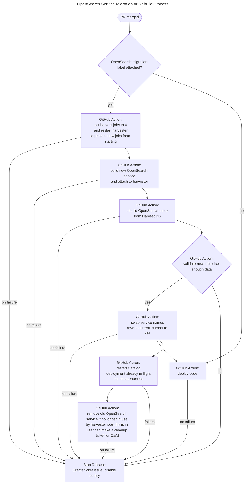

```mermaid
---
title: OpenSearch Service Migration or Rebuild Process
---
flowchart TD
	trigger([PR merged]) --> labelCheck{OpenSearch migration label attached?}

	labelCheck -->|yes| scaleHarvest[GitHub Action:<br/>set harvest jobs to 0<br/>and restart harvester<br/>to prevent new jobs from starting]
	labelCheck -->|no| deployCodeOnly[GitHub Action:<br/>deploy code]
	scaleHarvest -->|on failure| halt
	deployCodeOnly -->|on failure| halt

	scaleHarvest --> buildService[GitHub Action:<br/>build new OpenSearch service<br/>and attach to harvester]
	buildService -->|on failure| halt

	buildService --> rebuildIndex[GitHub Action:<br/>rebuild OpenSearch index<br/>from Harvest DB]
	rebuildIndex -->|on failure| halt
	rebuildIndex --> validateIndex{GitHub Action:<br/>validate new index has<br/>enough data}

	validateIndex -->|yes| swapServices[GitHub Action:<br/>swap service names<br/>new to current, current to old<br>]
	validateIndex -->|no| halt[Stop Release:<br/>Create ticket issue, disable deploy<br>]
	swapServices -->|on failure| halt

	swapServices --> deployCodeOnly[GitHub Action:<br/>deploy code]
	swapServices --> restartCatalogMigration[GitHub Action:<br/>restart Catalog<br/>deployment already in flight<br/>counts as success]
	restartCatalogMigration --> removeOld[GitHub Action:<br/>remove old OpenSearch service if no longer in use by harvester jobs; if it is in use then make a cleanup ticket for O&M]
	restartCatalogMigration -->|failure| halt
	removeOld -->|on failure| halt
```
