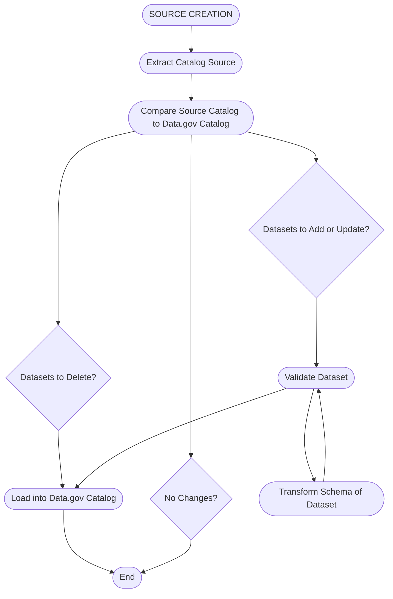

# Harvesting Pipeline Structure

## Old Harvesting Logic
Unique to each file + schema format

```mermaid
flowchart LR
  sc([SOURCE CREATION])
  gs([GATHER STAGE])
  fs([FETCH STAGE])
  is([IMPORT STAGE])
  sc --> gs
  gs --> fs
  fs --> is
```

## New Harvesting Logic
Universal to all file + schema formats

```mermaid
flowchart TD
  sc([SOURCE CREATION])
  extract([Extract Catalog Source])
  compare([Compare Source Catalog to Data.gov Catalog])
  nochanges{No Changes?}
  deletions{Datasets to Delete?}
  updates{Datasets to Add or Update?}
  load([Load into Data.gov Catalog])
  validate([Validate Dataset])
  transform([Transform Schema of Dataset])
  completed([End])

  sc --> extract
  extract --> compare
  compare --> deletions
  compare --> updates
  deletions --> load
  updates --> validate
  validate --> transform
  transform --> validate
  validate --> load
  load --> completed
  compare --> nochanges
  nochanges --> completed
```
