# Harvesting Pipeline Structure

To generate diagrams, run the mermaid-cli:
```bash
docker run --rm -u `id -u`:`id -g` -v ./:/data minlag/mermaid-cli -i new_harvesting.mmd -o new_harvesting.svg [-t dark -b transparent]
```

## Old Harvesting Logic
Unique to each file + schema format


## New Harvesting Logic
Universal to all file + schema formats

