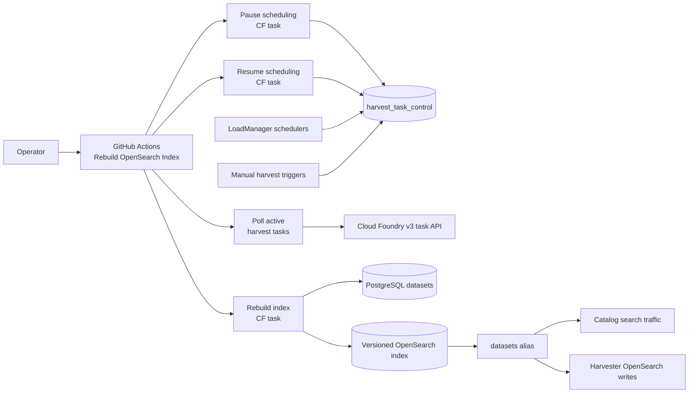
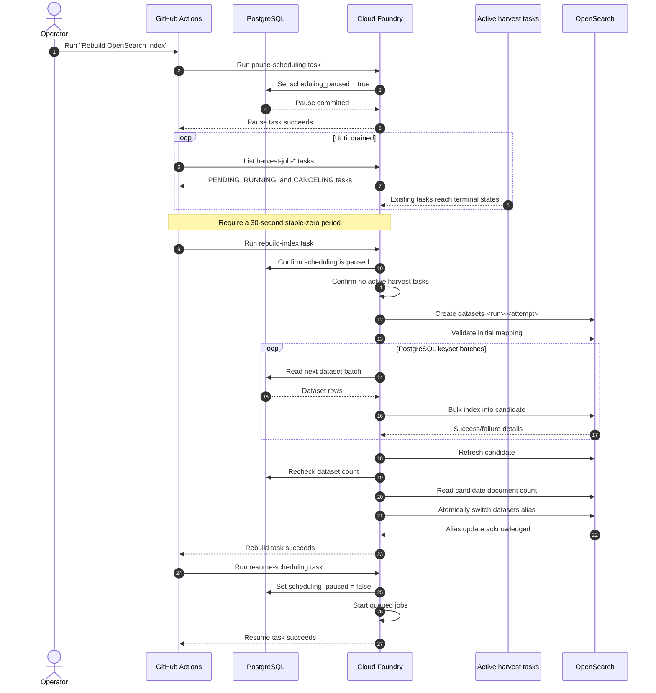
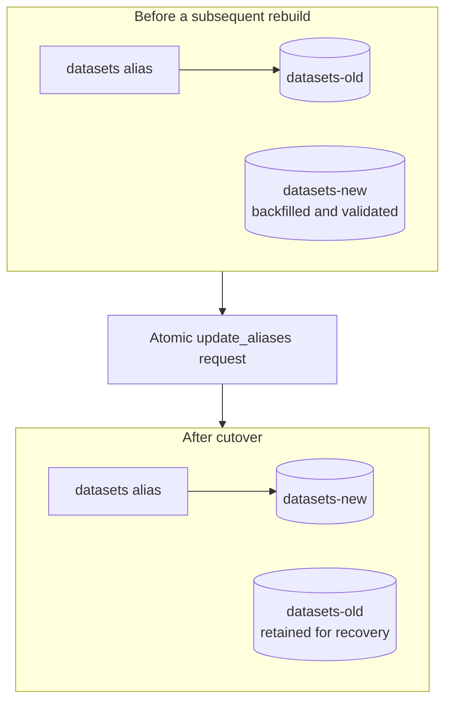
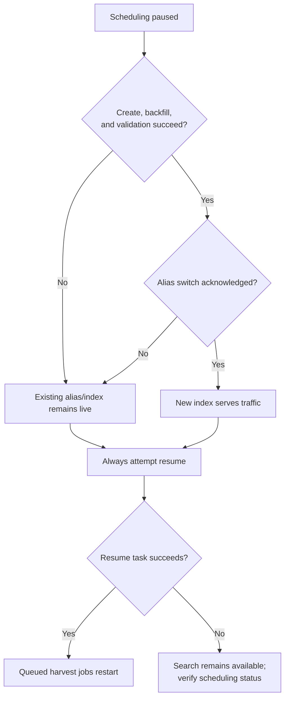

# OpenSearch Index Rebuild and Alias Cutover

This document describes how Data.gov rebuilds the OpenSearch dataset index
without interrupting search traffic. Harvest processing is paused during the
rebuild so PostgreSQL remains the stable source of truth. A replay or change-log
table is not required.

## Goals

- Keep the existing OpenSearch index available to readers during the backfill.
- Prevent dataset mutations while the new index is being built.
- Fail before cutover if any dataset cannot be indexed or validation fails.
- Switch all readers and writers atomically through the `datasets` alias.
- Preserve queued harvest jobs and resume them after the operation.

Search remains available throughout the operation. Harvest jobs are delayed for
the duration of the backfill.

## Components



The `harvest_task_control` table contains a singleton row. When
`scheduling_paused` is true:

- `_start_new_jobs()` does not dispatch scheduled jobs.
- `start_job()` cannot create a CF task.
- Manual harvest triggers do not create or start an immediate job.
- A completed harvest cannot chain another task through
  `check_for_more_work()`.
- Manual dataset slug edits are rejected.

The flag is read directly from PostgreSQL at each scheduling boundary; it is not
cached and does not require an application restart or load-balancer fan-out.
Future scheduled jobs may remain in the database with status `new`.

## Automated rebuild sequence

The manual GitHub Actions workflow is
`.github/workflows/rebuild_opensearch_index.yml`.



### 1. Pause dispatch

The workflow runs:

```shell
flask harvest_job pause-scheduling
```

Running harvest tasks are not canceled. They finish normally, including their
database and OpenSearch writes. Their final attempt to schedule more work sees
the shared pause flag and does nothing.

### 2. Drain active tasks

`bin/wait_for_harvest_tasks.sh` polls the Cloud Foundry v3 task API for
`harvest-job-*` tasks in these non-terminal states:

- `PENDING`
- `RUNNING`
- `CANCELING`

After the active count reaches zero, it must remain zero for 30 seconds. The
default drain timeout is two hours. An API failure or timeout fails the workflow
instead of assuming the system is drained.

### 3. Create and backfill the candidate

The workflow creates a unique physical index:

```text
datasets-<github-run-id>-<github-run-attempt>
```

It then invokes:

```shell
flask search rebuild-index \
  --target-index datasets-<run-id>-<attempt> \
  --allow-legacy-index-removal
```

The command refuses to proceed unless scheduling is paused and no active
harvest tasks remain. It:

1. Creates the empty physical index with the application mappings and settings.
2. Validates the mapping before indexing dynamic dataset fields.
3. Reads every PostgreSQL `Dataset` row using ID-based keyset pagination.
4. Bulk indexes batches of 1,000 documents by default.
5. Stops on any bulk failure.
6. Refreshes the candidate.
7. Confirms the PostgreSQL count did not change during the backfill.
8. Confirms the candidate document count equals the PostgreSQL count.

Because the candidate starts empty, dataset IDs are unique, every successful
bulk result is counted, and PostgreSQL mutations are paused, these checks ensure
that every source dataset is represented before cutover.

### 4. Atomically switch the alias

Normal operation addresses OpenSearch through the logical name `datasets`.
Physical indexes use versioned names.



For subsequent rebuilds, one `update_aliases` request removes the alias from the
old physical index and adds it to the candidate with `is_write_index: true`.
The old physical index is retained.

### First alias conversion

Before this feature is used for the first time, `datasets` may still be a
concrete index. An alias cannot have the same name as an existing concrete
index. The first cutover therefore performs these actions atomically:

1. `remove_index` for the legacy concrete `datasets` index.
2. Add the `datasets` alias to the validated candidate.

The `--allow-legacy-index-removal` option makes this one-time deletion explicit.
The legacy index is not retained, so take an OpenSearch snapshot first if its
contents must be independently recoverable. Later rebuilds retain the previous
versioned index.

## Failure behavior



- A failure before alias cutover leaves the existing live index unchanged.
- A partially built candidate may remain for diagnosis and can be deleted
  manually.
- Alias changes are submitted as one atomic OpenSearch operation.
- The workflow uses `if: always()` to attempt scheduling recovery after earlier
  failures.
- If the runner is force-canceled or the recovery task fails, scheduling may
  remain paused as the safe failure mode. Search continues to work.

Manual recovery:

```shell
flask harvest_job scheduling-status
flask harvest_job resume-scheduling --start-jobs
```

Run these as CF tasks against the affected environment. Only resume after
confirming that no index rebuild is still running.

## Operational runbook

### Prerequisites

1. Deploy the application version containing the migration and rebuild command.
2. Confirm the database migration created `harvest_task_control`.
3. Confirm external consumers access `datasets` by name and can use an alias.
4. For the first conversion, decide whether an OpenSearch snapshot is required.
5. Avoid direct database writes or uncoordinated maintenance commands during the
   rebuild.

### Run

1. Open **Actions → Rebuild OpenSearch Index**.
2. Select `development`, `staging`, or `prod`.
3. Run the workflow.
4. Monitor the pause, drain, rebuild, validation, alias switch, and resume steps.

GitHub Actions applies the concurrency group
`opensearch-maintenance-<environment>`, so rebuild and synchronization workflows
for the same environment do not overlap.

### Verify

1. Confirm the workflow completed successfully.
2. Run `flask harvest_job scheduling-status`; it should report `enabled`.
3. Confirm the `datasets` alias points to the new physical index.
4. Confirm queued harvest jobs have started.
5. Exercise catalog searches and inspect OpenSearch/harvester logs.

### Remove a retained physical index

After the new index has been verified and the rollback window has passed, use
**Actions → Delete OpenSearch Physical Index** to remove an old index:

1. Select the Cloud Foundry environment.
2. Enter the exact physical index name printed by the rebuild, such as
   `datasets-123456-1`.
3. Run the workflow and verify the Cloud Foundry task succeeds.

The workflow shares the environment-specific OpenSearch maintenance concurrency
group with rebuild and synchronization operations. The command only accepts
physical names beginning with `datasets-`, verifies that the index exists, and
refuses to delete the index currently targeted by the `datasets` alias. The
logical `datasets` name and aliases cannot be deleted through this workflow.

## Related implementation

- `.github/workflows/rebuild_opensearch_index.yml` — operation orchestration.
- `.github/workflows/delete_opensearch_index.yml` — guarded old-index cleanup.
- `bin/wait_for_harvest_tasks.sh` — active-task drain and quiet period.
- `app/commands/job.py` — pause, status, and resume commands.
- `app/commands/search.py` — candidate creation, validation, cutover, and cleanup.
- `database/harvest_models.py` — singleton scheduling control model.
- `database/interface.py` — uncached scheduling flag access.
- `harvester/lib/load_manager.py` — scheduling gates.
- `harvester/lib/cf_handler.py` — active CF harvest-task discovery.
- `harvester/opensearch.py` — physical-index and alias operations.

The older `search reset-mapping` command is blocked after `datasets` becomes an
alias because deleting an alias expression could delete the live backing index.
Use the rebuild workflow for future mapping changes.
