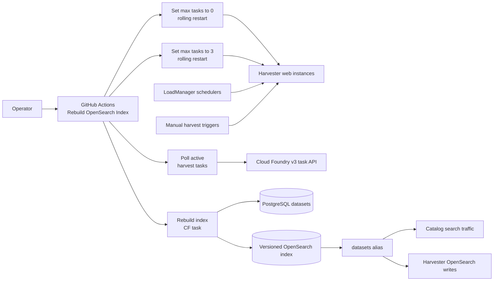
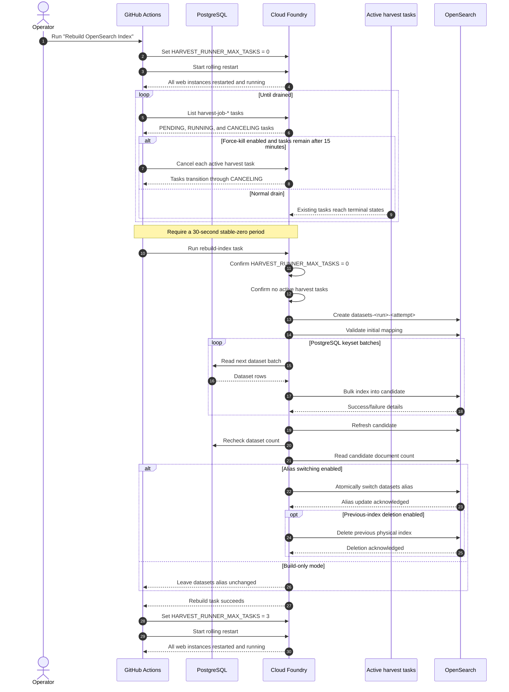
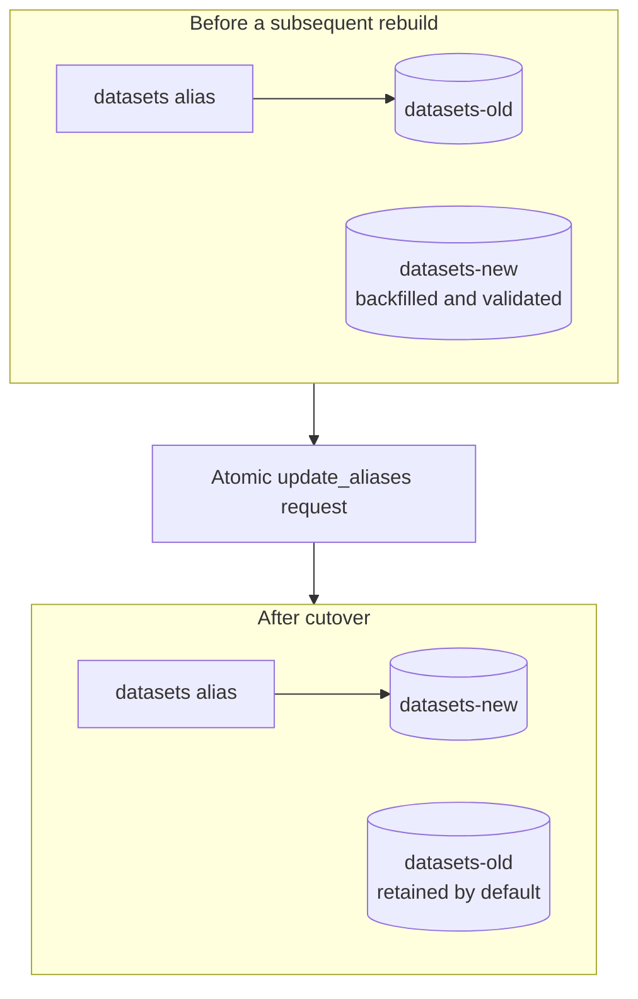
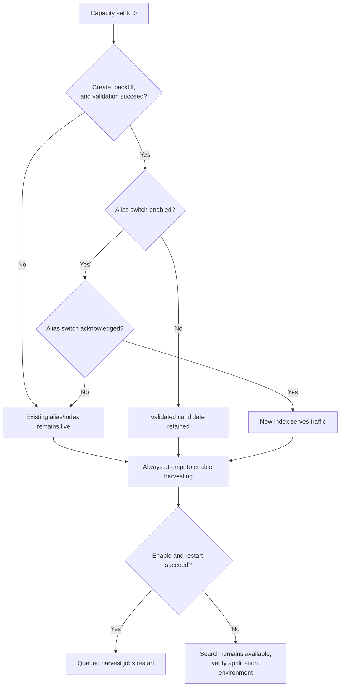

# OpenSearch Index Rebuild and Alias Cutover

This document describes how Data.gov rebuilds the OpenSearch dataset index
without interrupting search traffic. Harvest capacity is set to zero and the
harvester is restarted so no new jobs run while a candidate index is built from
PostgreSQL. Queued jobs remain in the database, and harvesting is enabled with
the standard capacity of three tasks afterward.

For the operator-facing steps, see
[docs/ops/rebuild-opensearch-index.md](ops/rebuild-opensearch-index.md).

## Goals

- Keep the existing OpenSearch index available to readers during the backfill.
- Prevent dataset mutations while the new index is being built.
- Fail before cutover if any dataset cannot be indexed or validation fails.
- Switch all readers and writers atomically through the `datasets` alias when
  the schema is compatible.
- Preserve queued harvest jobs and resume them after the operation.

Search remains available throughout the operation. Harvest jobs are delayed for
the duration of the backfill.

## Components



The workflow uses the same capacity-control script as **Toggle Harvester**. It
sets `HARVEST_RUNNER_MAX_TASKS` to `0` and performs a rolling restart. When the
setting is `0`:

- `_start_new_jobs()` does not dispatch scheduled jobs.
- `start_job()` cannot create a CF task.
- Manual harvest triggers do not create or start an immediate job.
- A completed harvest cannot chain another task through
  `check_for_more_work()`.
- Manual dataset slug edits are rejected.

The setting is read when each process starts, so changing it requires a restart.
The workflow initiates that restart directly rather than waiting for the
periodic restart workflow. It confirms that no rolling deployment remains
active, the desired number of web instances are present, every instance is
running with a new instance GUID, and the application environment has the
requested value. Future scheduled jobs may remain in the database with status
`new`.

## Automated rebuild sequence

The manual GitHub Actions workflow is
`.github/workflows/rebuild_opensearch_index.yml`.



### 1. Pause dispatch

The workflow uses the shared toggle script to run:

```shell
cf set-env datagov-harvest HARVEST_RUNNER_MAX_TASKS 0
cf restart datagov-harvest --strategy rolling
```

It waits for Cloud Foundry to confirm the rolling restart is complete and every
desired web instance is running with the new application environment. Running
harvest tasks are not restarted or canceled. Tasks that began with the previous
setting may schedule one final follow-on task, so the workflow still drains the
Cloud Foundry task queue before starting the rebuild.

### 2. Drain active tasks

`bin/wait_for_harvest_tasks.sh` polls the Cloud Foundry v3 task API for
`harvest-job-*` tasks in these non-terminal states:

- `PENDING`
- `RUNNING`
- `CANCELING`

After the active count reaches zero, it must remain zero for 30 seconds. The
default behavior waits up to two hours and fails the workflow on timeout.

For manually dispatched workflows, the optional **Cancel harvest jobs still
running after 15 minutes** input changes the drain behavior. After 15 minutes,
the workflow requests cancellation of every active `harvest-job-*` task through
the Cloud Foundry API. It continues polling until all canceled tasks reach a
terminal state and the 30-second quiet period passes. API failures still fail
the workflow instead of assuming the system is drained.

### 3. Create and backfill the candidate

The workflow creates a unique physical index:

```text
datasets-<github-run-id>-<github-run-attempt>
```

It then invokes:

```shell
flask search rebuild-index \
  --target-index datasets-<run-id>-<attempt> \
  --switch-alias
```

For the first alias conversion only, the workflow adds
`--allow-legacy-index-removal` when the operator explicitly enables the
corresponding checkbox.

The command refuses to proceed unless `HARVEST_RUNNER_MAX_TASKS` is `0` and no
active harvest tasks remain. It:

1. Creates the empty physical index with the application mappings and settings.
2. Validates the mapping before indexing dynamic dataset fields.
3. Reads every PostgreSQL `Dataset` row using ID-based keyset pagination.
4. Bulk indexes batches of 1,000 documents by default.
5. Stops on any bulk failure.
6. Refreshes the candidate.
7. Confirms the PostgreSQL count did not change during the backfill.
8. Confirms the candidate document count equals the PostgreSQL count.

Because the candidate starts empty, dataset IDs are unique, every successful
bulk result is counted, and PostgreSQL mutations are paused, these checks ensure
that every source dataset is represented before cutover.

### 4. Atomically switch the alias

Normal operation addresses OpenSearch through the logical name `datasets`.
Physical indexes use versioned names.



For subsequent rebuilds, one `update_aliases` request removes the alias from the
old physical index and adds it to the candidate with `is_write_index: true`.
The old physical index is retained unless the operator explicitly enables
**Delete the previous physical index after a successful alias switch**. That
input defaults to disabled. When enabled, deletion runs only after OpenSearch
acknowledges the alias switch, and the same physical-name and alias guards used
by the standalone cleanup command still apply.

### First alias conversion

Before this feature is used for the first time, `datasets` may still be a
concrete index. An alias cannot have the same name as an existing concrete
index. The first cutover therefore performs these actions atomically:

1. `remove_index` for the legacy concrete `datasets` index.
2. Add the `datasets` alias to the validated candidate.

The workflow checkbox **Allow the one-time replacement of a concrete datasets
index** defaults to disabled. Enabling it passes
`--allow-legacy-index-removal`, making this one-time deletion explicit. Without
that opt-in, the command fails before creating the candidate. The legacy index
is not retained, so take an OpenSearch snapshot first if its contents must be
independently recoverable. Later rebuilds retain the previous versioned index
and do not require the checkbox.

### Build without switching the alias

The workflow input **Switch the datasets alias to the rebuilt index** is enabled
by default. Disabling it passes `--no-switch-alias`, which creates, backfills,
and validates the physical index but leaves `datasets` unchanged. The workflow
still enables harvesting with capacity `3` afterward.

Use this mode for incompatible mapping changes (for example renaming a field).
Switching the live alias immediately would expose the new schema to Catalog
while it still expects the old one. The coordinated rollout is:

1. Run the rebuild with alias switching disabled. Note the physical index name
   printed by the workflow (for example `datasets-<run-id>-<attempt>`).
2. Deploy Catalog (and Harvester, if its writers also depend on the new schema)
   configured to read that physical index directly, not through `datasets`.
3. After Catalog is healthy on the new schema, point the `datasets` alias at the
   physical index so other consumers can return to the logical name.
4. Redeploy Catalog/Harvester back to the `datasets` alias once that is safe.

There is no standalone GitHub Actions workflow or Flask CLI today that only
points `datasets` at an existing physical index. Alias cutover is performed by
`OpenSearchInterface.switch_alias()` inside `flask search rebuild-index` when
`--switch-alias` is set. For a post-deploy cutover after a build-only rebuild,
an operator must either add a thin CLI wrapper around that method or invoke the
same `update_aliases` request manually against OpenSearch. Do not re-run
`rebuild-index --switch-alias` just to flip the alias; that recreates and
backfills another candidate.

## Failure behavior



- A failure before alias cutover leaves the existing live index unchanged.
- A partially built candidate may remain for diagnosis and can be deleted
  manually.
- Alias changes are submitted as one atomic OpenSearch operation.
- Optional previous-index deletion occurs only after an acknowledged alias
  switch. If deletion fails, the new alias target remains active and the
  rebuild task reports failure.
- The workflow uses `if: always()` to set capacity to `3` and perform another
  verified rolling restart after earlier failures. This enables harvesting
  even when it was disabled before the rebuild began.
- If the runner is force-canceled or recovery fails,
  `HARVEST_RUNNER_MAX_TASKS` may remain `0` as the safe failure mode. Search
  continues to work.

Manual recovery:

```shell
cf env datagov-harvest
cf set-env datagov-harvest HARVEST_RUNNER_MAX_TASKS 3
cf restart datagov-harvest --strategy rolling
```

Only enable capacity after confirming that no index rebuild is still running,
then verify all desired app instances are running.

## Operational runbook

Operator steps for compatible rebuilds and breaking schema changes are in
[docs/ops/rebuild-opensearch-index.md](ops/rebuild-opensearch-index.md).

### Prerequisites

1. Deploy the application version containing the zero-capacity scheduling gates
   and rebuild command.
2. Confirm external consumers access `datasets` by name and can use an alias.
3. For the first conversion, decide whether an OpenSearch snapshot is required.
4. Avoid direct database writes or uncoordinated maintenance commands during the
   rebuild.

### Run

1. Open **Actions → Rebuild OpenSearch Index**.
2. Select `development`, `staging`, or `prod`.
3. Optionally enable **Cancel harvest jobs still running after 15 minutes**.
4. Leave **Switch the datasets alias to the rebuilt index** enabled for a
   compatible atomic cutover, or disable it for a breaking-schema build-only
   rebuild.
5. Leave **Delete the previous physical index after a successful alias switch**
   disabled to retain a rollback index. Enable it only when immediate cleanup
   is preferred.
6. Run the workflow.
7. Monitor capacity change, rolling restart, drain, rebuild, validation,
   optional alias switch and cleanup, capacity enablement, and final rolling
   restart.

GitHub Actions applies the concurrency group
`opensearch-maintenance-<environment>`, so rebuild and synchronization
workflows, the periodic Harvester restart workflow, physical-index cleanup,
and **Toggle Harvester** for the same environment do not overlap.
`cancel-in-progress: false` protects the running operation, and `queue: max`
allows up to 100 pending operations to wait instead of replacing older pending
runs.

### Verify

1. Confirm the workflow completed successfully.
2. Run `cf env datagov-harvest` and confirm
   `HARVEST_RUNNER_MAX_TASKS` matches its state before the rebuild.
3. If alias switching was enabled, confirm the `datasets` alias points to the
   new physical index. Otherwise, confirm it did not change.
4. Confirm queued harvest jobs have started.
5. Exercise catalog searches and inspect OpenSearch/harvester logs.

### Remove the retained physical index manually

The rebuild workflow retains the previous physical index for rollback by
default. The **Monitor index rebuild** step prints
`Previous index retained: <index-name>` and identifies the new index targeted
by the `datasets` alias.

An operator can instead enable **Delete the previous physical index after a
successful alias switch**. This performs guarded cleanup immediately after the
cutover succeeds, but removes the rollback index. When the input is disabled,
deleting the old index remains a manual post-rebuild step.

> [!WARNING]
> Do not retain obsolete indexes longer than necessary. They consume cluster
> storage and resources, and failure to delete them may result in degradation
> of the OpenSearch cluster. After verifying that production is operating
> correctly, delete the old index.

Use **Actions → Delete OpenSearch Physical Index** to remove the old index:

1. Select the Cloud Foundry environment.
2. Enter the exact physical index name printed by the rebuild, such as
   `datasets-123456-1`.
3. Run the workflow and verify the Cloud Foundry task succeeds.

The workflow shares the environment-specific OpenSearch maintenance concurrency
group with rebuild and synchronization operations. The command only accepts
physical names beginning with `datasets-`, verifies that the index exists, and
refuses to delete the index currently targeted by the `datasets` alias. The
logical `datasets` name and aliases cannot be deleted through this workflow.

## Related implementation

- `.github/workflows/rebuild_opensearch_index.yml` — operation orchestration.
- `.github/workflows/toggle_harvester.yml` — manual check/enable/disable entrypoint.
- `.github/workflows/delete_opensearch_index.yml` — guarded old-index cleanup.
- `bin/set_harvest_runner_capacity.sh` — shared check/enable/disable commands,
  rolling restarts, and health confirmation.
- `bin/wait_for_harvest_tasks.sh` — active-task drain and quiet period.
- `app/commands/search.py` — candidate creation, validation, cutover, and cleanup.
- `harvester/runner_settings.py` — shared harvest capacity configuration.
- `harvester/lib/load_manager.py` — scheduling gates.
- `harvester/lib/cf_handler.py` — active CF harvest-task discovery.
- `harvester/opensearch.py` — physical-index and alias operations.

The older `search reset-mapping` command is blocked after `datasets` becomes an
alias because deleting an alias expression could delete the live backing index.
Use the rebuild workflow for future mapping changes.
